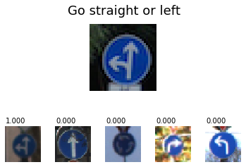
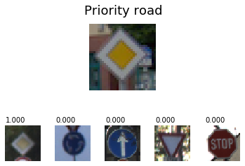
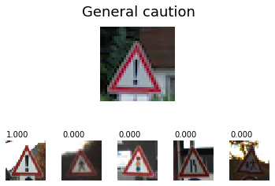
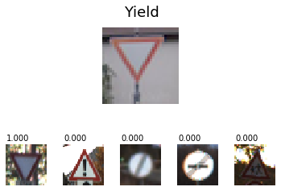
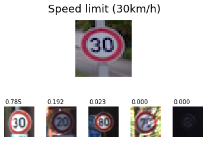
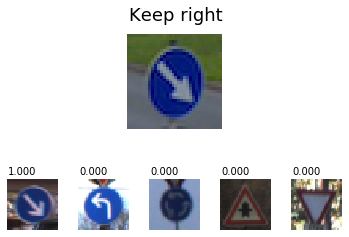
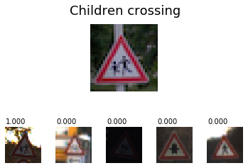
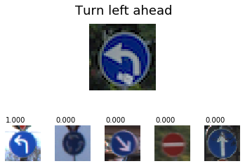
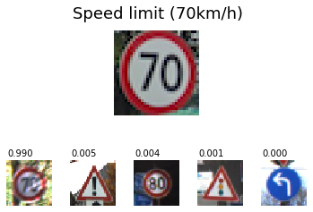

# **Traffic Sign Recognition** 

## Writeup

---

**Build a Traffic Sign Recognition Project**

The goals / steps of this project are the following:
* Load the data set (see below for links to the project data set)
* Explore, summarize and visualize the data set
* Design, train and test a model architecture
* Use the model to make predictions on new images
* Analyze the softmax probabilities of the new images
* Summarize the results with a written report

[//]: # (Image References)

[img_jitter]: ./writeup_images/jitter.png "Jitering"
[img_distribution]: ./writeup_images/test_distribution.png "Distribution"
[img_new]: ./writeup_images/new_images.png "New test images"
[img_new_results]: ./writeup_images/new_images_results.png "New test images - results"
[img_normalization]: ./writeup_images/normalization.png "Normalization"

---
### Data Set Summary & Exploration

The data set was loaded using pickle. Basics statistics were gathered: 

* The size of training set is 34799
* The size of the validation set is 4410
* The size of test set is 12630
* The shape of a traffic sign image is (32, 32, 3)
* The number of unique classes/labels in the data set is 43

I calculated the histogram of training set to visualize the distribution of traffic signs:

![Test set distribution][img_distribution]

It appears that that some values are heavily underrepresented, which caused problems during initial training. This was addressed by augumenting the data set (described below). 

### Model Architecture

#### Data pre-processing

Each image in training set is preprocessed:
* Convert to grayscale
* Increase local contrast using CLAHE
* Normalize

While colors of signs give a lot of information to humans, they did not actually improve my network: grayscale performed better. I decided to convert images to gray.
I used the CLAHE function from OpenCV to increase which performs adaptive histogram equalization. This emphasises the contours on the signs, improving the network efficiency.

Examples of processed images:
![Preprocess][img_normalization]

As the last step, image is normalized to reduce mean and provide better numerical stability. 

#### Data augmentation
As described in _Data Set Summary & Exploration_, some traffic signs are underrepresented in the training set, which causes bad network performance for those labels.
I have therefore decided to extend the data set. Each sign with have n additional images, where n is _(Count of images for most represented sign)-(Count of images in current set) + 100.

Each additional image is generated by using the following algorithm:
* Translate randomly in X-axis by (-2;2) pixels range
* Translate randomly in Y-axis by (-2;2) pixels range
* Rotate randomly in (-10;10) degree range
* Scale randomly in X-axis by (0.9;1.1) factor
* Scale randomly in Y-axis by (0.9;1.1) factor

This introduces a small jitter to the images, which actually greatly increased efficiency. It was important to scale independently in x and y axis to simulate better camera deformations.   

As the result, the training set has **90730** items.

Examples of augmented images:

![Augumented images][img_jitter]

As a last step, I normalized the image data because ...

#### 2. Model architecture
I decided to implement architecture based on _Traffic Sign Recognition with Multi-Scale Convolutional Networks_ by _Pierre Sermanet and Yann LeCun_.
My network consists of three convolution layers and two fully connected ones. Regularization by dropout is used on full layers, and a kind of inception is used by feeding first of them by results of both second and third convolution.
All activation functions are relu.

| Layer         		|     Description	        					|  Output  |
|:---------------------:|:---------------------------------------------:| :--------|
| Input         		| 32x32x1 Graysacale image 						| 
| Convolution 5x5     	| 1x1 stride, VALID padding 	                | 28x28x6  |
| RELU					|												|          |
| Max pooling	      	| 2x2 stride 		                        	| 14x14x6  |
|                       |                                               |          |
| 2nd Convolution 5x5	| 1x1 strinde, VALID padding	                | 10x10x16 |
| RELU                  |                                               |          | 
| `C2` Max pooling      | 2x2 stride                                    | 5x5x16   | 
|                       |                                               |          |
| `C3` 3rd Convolution 5x5	| 1x1 stride, VALID padding	                | 1x1x400  |
|                       |                                               |          |
| Merge input           | Flatten `C2` and `C3`. Concat results.        | 800      |
| Dropout               | 50%                                           |          |
| Fully connected		|           									| 150      |
| Dropout               | 50%                                           |          |
| Fully connected 		| Classifier        							| 43       |

#### 3. Model training
The model was trained using loss operation and optimizer from LeNet lab as they provided good performance:
* Loss operation: reduce mean of softmax cross entropy
* Optimizer: Adam

Data was shuffled before training.
Training had 30 Epochs, as the learning curve flattened afterwards.
Batch size was 150.

#### 4. Approach

Final results of my model are:
* training set accuracy of 99,7%
* validation set accuracy of 98,8%
* test set accuracy of 96,9%

I started from generic LeNet model from the lab and original color images (normalized). The model was clearly overfitting, having much lower accuracy on validation and set.
At the first stage, I focused on improving the pre-processing. I have found that gray images produce better effects and color. I introduced simple histogram equalization and finally changed it to CLAHE.

At the second stage, I changed the model architecture to one described in _Traffic Sign Recognition with Multi-Scale Convolutional Networks_  paper. They have achieved great results so I wanted to check how close I can get.
The change involved introducing third convolutional layer, dropping one fully-connected and introducing inception.

The results were still not fully satisfying, so I decided to augment the training data. I have decided to include rotation, translation and scale to produce extended data set. Initially I used one random parameter for scale, but it appeared that network behaves better is scaling is done independently on x and y axis.

Finally, I introduced regularization by using dropout of 50% on inputs of fully connected layers. I tried different percentages, but 50% worked best.

The results are pretty good, although not as good as Sermanet and LeCun achieved. They don't describe their network in details, but this may be by the was they preprocess images or adjust hyperparameters. They also explictly mention using more complicated activation function, which can also may have effect on results.  
Anyway, the model is still performing well on not-known images.

### Test a Model on New Images

#### New traffic images 

I have used Google StreetView (now partially present in Germany) to gather images of some real traffic signs:

 
Here are five German traffic signs that I found on the web:

![Streetview images][img_new]

This images include both rather good quality signs that should not give network any difficulty, but also a few tricky examples"
* Yield covers only on 2/3 of the image
* Speed limit (30km/h) is warped, as it is taken from the edge of wide angle camera
* Keep right is taken from the angle, so it's more like ellipse than circle
* Turn left ahead has a big sticker on it

Finally, the Speed limit (70km/h) *is not a German but a Polish sign* and uses different font. This involves no difficulty for humans, but might be a huge challenge for neural network which had no chance to see such image before.

#### 2. Results

The model recognized *all* the signs correctly, therefore achieving the accuracy of 100%.

The probabilities of predictions is as follows:

Here are the results of the prediction:

Correctly predicted the sign.

---

Correctly predicted the sign.

---

Correctly predicted the sign.

---

Correctly predicted the sign.

---

Correctly predicted the sign, but the probability is just 78%.
Other speed limit signs have high rankings, meaning network could misinterpret speed limit signs.

---

Correctly predicted the sign.

---

Correctly predicted the sign.

---

Correctly predicted the sign, even if the arrow head is slightly different and there is a big sticker on a sign.

---

Polish sign. Network made it, nut it's worth noting that the second most probable was not a speed limit sign but general caution, which does not even have circular shape.

It's clearly visible that speed limits are most problematic. For network, it's pretty easy to mismatch 30 with 80, especially if the quality is not perfect (blurred, noisy image). This seems to be the biggest problem, as recently there were there [articles how easily is to fool a tesla on 3X speed limit sign!](https://www.businessinsider.com/hackers-trick-tesla-accelerating-85mph-using-tape-2020-2?IR=T)

